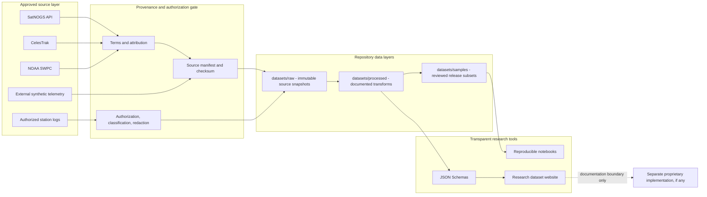

# GroundPulse AI Research Datasets


GroundPulse.ai is an open research repository foundation for source-backed satellite and ground-segment datasets.

> Current dataset status: empty. No SatNOGS, CelesTrak, NOAA, synthetic telemetry, or ground-station log records are committed. Missing telemetry fields are never fabricated.

## Research scope

The repository prepares adapters, import controls, schemas, provenance requirements, notebooks, and documentation. It is not an operational satellite platform and contains no customer data, live integration, production intelligence pipeline, or agent orchestration.

## Intended sources

| Source | Intended role | Repository status |
|---|---|---|
| SatNOGS API | Satellite, transmitter, and observation metadata | Adapter prepared; collection not run |
| CelesTrak | Orbital GP / OMM records | Adapter prepared; collection not run |
| NOAA SWPC | Space-weather context | Adapter prepared; collection not run |
| Synthetic telemetry | Externally generated simulation with documented methodology | Import-only; no data supplied |
| Ground-station logs | Authorized equipment and event records | Import-only; no data supplied |

These sources remain separate. They cannot be honestly converted into SNR, Eb/No, modem temperature, packet loss, pass outcomes, incidents, or anomaly labels unless those measurements are present in an authorized source.

## Architecture



Solid arrows describe the intended controlled flow, not proof that data has been collected. At the current release, every data directory is empty except for explanatory README files.

## Repository structure

```text
groundpulse-datasets/
├── README.md
├── LICENSE
├── CONTRIBUTING.md
├── SECURITY.md
├── CITATION.cff
├── datasets/
│   ├── raw/
│   ├── processed/
│   └── samples/
├── schemas/
├── generator/
│   ├── fetch_public_sources.py
│   ├── import_ground_station_logs.py
│   └── import_synthetic_telemetry.py
├── notebooks/
├── examples/
├── docs/
└── src/
```

## Collection policy

Public-source collection is an explicit maintainer action. Each accepted snapshot must include its source URL, retrieval time, source timestamp when available, applicable terms, checksum, adapter version, and transformation history.

Ground-station logs require authorization, classification, redaction, secret review, and retention approval. Synthetic telemetry requires the external generator name, version, methodology, and a `synthetic: true` provenance record.

## Local website

```bash
npm install
npm run dev
```

The website is a research repository overview. It does not visualize data until reviewed datasets exist.

## Implementation plan

1. Finalize source selection, terms, attribution, and release policy.
2. Add offline adapter fixtures that contain no operational or private data.
3. Test provenance manifests, checksums, retries, and rate limits.
4. Collect a maintainer-approved source snapshot.
5. Define documented transformations without invented joins or imputation.
6. Review and publish a versioned sample release.
7. Add notebooks only after real or explicitly supplied synthetic data exists.

See `docs/implementation_plan.md`, `docs/TASKS.md`, `docs/data_sources.md`, and `docs/limitations.md` for detailed controls.

## License

Repository code is Apache-2.0. External source records retain their original terms; this repository does not relicense SatNOGS, CelesTrak, NOAA, or supplied logs.
